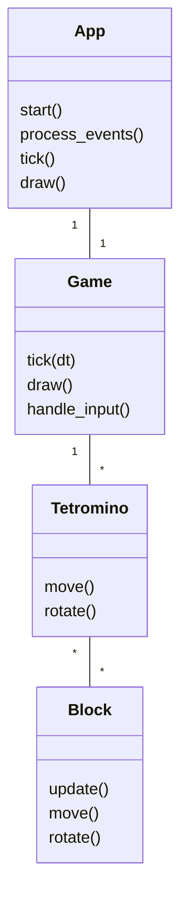
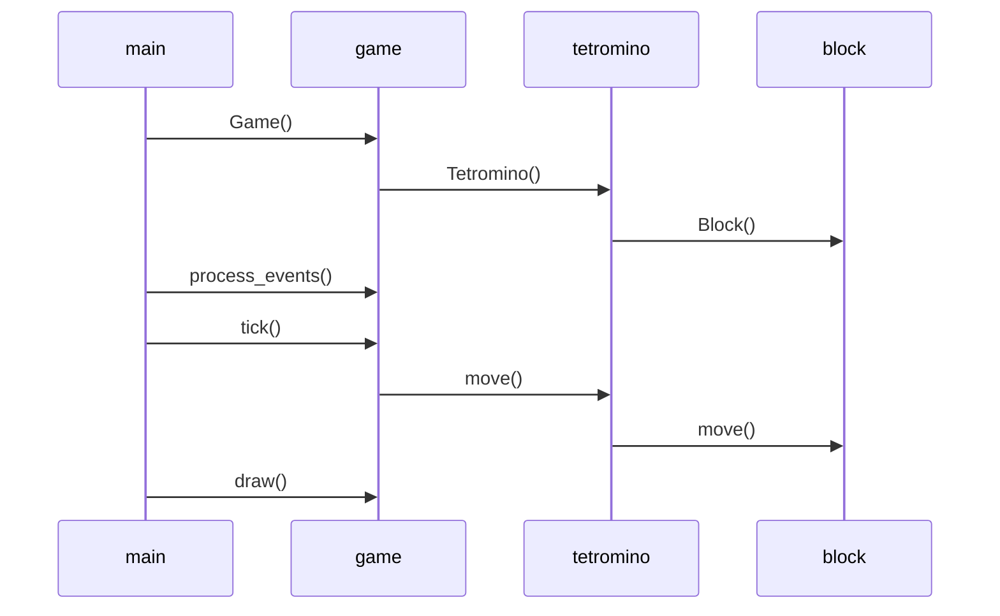

# Arkkitehtuurikuvaus

## Pelilogiikka
Aluksi ohjelma luo App-luokan, joka alustaa ohjelman ja aloitta pelisilmukan.
Pelin logiikka tapahtuu Game-luokassa, jota päivitetään App-luokasta kutsumalla funktioita tick(), draw() ja handle_input().
Game-luokan tick() funktio päivittää palikoita, pitää niistä listaa ja tarkastaa täydet rivit.
Tetromino-luokka on yksittäisistä paloista (Block-luokka) koostuva palikka, ja sitä voi ohjata kutsumalla funktioita move() ja rotate().

Pelisilmukan toiminta sekvenssikaaviona
