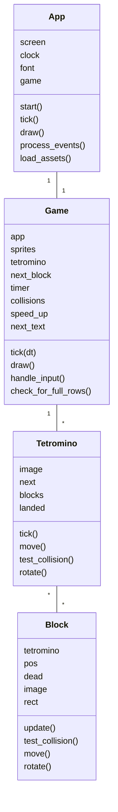

# Arkkitehtuurikuvaus

## Käyttöliittymä
Käyttöliittymä koostuu kolmesta näkymästä

- Menu
- Peli näkymä
- Tulokset 

## Pelilogiikka
Pelin logiikka tapahtuu Game-luokassa. Aluksi ohjelma luo App-luokan, joka luo Game-luokan.
Game-luokkaa päivitetään App-luokasta kutsumalla funktioita tick(), draw() ja handle_input().
Pelin tick() funktio päivittää palikoita, pitää niistä listaa ja tarkastaa täydet rivit.

```mermaid
classDiagram

App  "1"  --  "1"  Game
Tetromino  "*"  --  "*"  Block
Game  "1"  --  "*"  Tetromino

class  App{
screen
clock
font
game

start()
tick()
draw()
process_events()
load_assets()
}

class  Game{

app
sprites
tetromino
next_block
timer
collisions
speed_up
next_text

tick(dt)
draw()
handle_input()
check_for_full_rows()
}

class  Tetromino{

image
next
blocks
landed

tick()
move()
test_collision()
rotate()
}

class  Block{

tetromino
pos
dead
image
rect

update()
test_collision()
move()
rotate()
}
```

